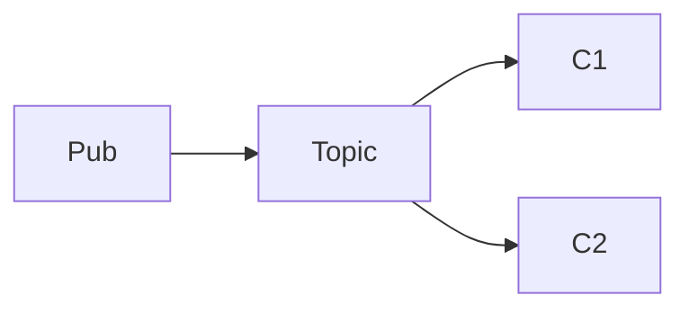

# Problem Statement Patterns (Quest)

Read the section that matches the target module. Gold files are the repo's best references.

## Gold References

| Type | Path | Why |
| --- | --- | --- |
| DSA (full) | `src/main/data_struct_algo/graph/traversal/Problem_Statement.md` | Complete I/O, examples, key points, optional hints |
| DSA (visual) | `src/main/data_struct_algo/linked_list/reverse_k_nodes_group/Problem_Statement.md` | Inline list diagrams in examples |
| DSA (compact) | `src/main/data_struct_algo/heaps/median_of_number_stream/Problem_Statement.md` | Tight example explanations |
| DSA (algorithm-specific) | `src/main/data_struct_algo/graph/smallest_cost_path/Problem_Statement.md` | Required algorithm + ASCII graph |
| Machine coding | `src/main/machine_coding/message_broker/Problem_Statement.md` | Requirements + edge cases |
| System design | `src/main/system_design/uber/Problem_Statement.md` | Needs refinement; use structure only |

## DSA Skeleton (default)

```markdown
# Problem Title

## Problem Description

[2–5 sentences: task, variants, special rules]

---

## Examples

### Example 1

**Input:**
```text
...
```

**Output:**
```text
...
```

**Explanation:**
- [1–3 bullets]

---

## Input Format

- ...

## Output Format

- ...

---

## Constraints

- `1 <= n <= 10^5`
- ...

---

## Key Points

1. [Non-obvious rule only]
```

Add `## Approach Hints` and `## Complexity Analysis` only when siblings in the same topic folder use them.

## Machine Coding Skeleton

```markdown
# Module Title

## Problem Statement

[One paragraph summary]

## Functional Requirements

### 1) ...
- ...

## Assumptions / Clarifications

1. ...

## Edge Cases to Consider

- ...

## Deliverables

1. Implementation
2. Demo
3. Tests
```

## System Design Skeleton

```markdown
# Design System Name

## Overview

[2–3 sentences]

## Functional Requirements

- ...

## Out of Scope

- ...

## Non-Functional Requirements

- ...

## Assumptions

- ...
```

Replace broken `` with mermaid or ASCII; do not leave dangling image links.

## Diagram Snippets

**Graph**

```text
(0) --3-- (1)
 |          ^
 1          2
 v          |
(2) --------
```

**Linked list**

```text
Before: 1 -> 2 -> 3 -> 4 -> 5
After:  2 -> 1 -> 4 -> 3 -> 5
```

**Histogram (trapping rain)**

```text
Index: 0  1  2  3  4  5  6
Value: 5  4  1  4  3  2  7
Water:       ~        ~  ~     (total = 11)
```

**Grid**

```text
o a a n
e t a e
i h k r
```

**Mermaid (flows only)**



## Anti-Patterns (seen in repo)

| Bad | Fix |
| --- | --- |
| Title only (`# Morris Traversal`) | Infer from `Code.*` |
| Flat legacy headings, double blank lines | Normalize to skeleton |
| `Rain Water Trapped` image refs without files | ASCII histogram |
| Repeating input format inside every example | Reference format once |
| Tutorial-length hints on simple problems | Omit or ≤3 bullets |

## Length Targets

| Type | Target lines |
| --- | --- |
| Simple DSA | 40–80 |
| Rich DSA (multi-mode) | 80–140 |
| Machine coding | 80–120 |
| System design | 60–100 |
