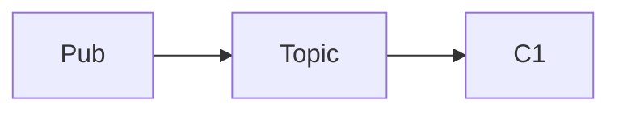

# Problem Statement Patterns (Quest)

Skeletons and inference rules for `refine-problem-statement`. **Do not hardcode neighbor file paths** — discover siblings at runtime (see SKILL.md).

---

## Find a Style Reference (dynamic)

Use when you need to match local repo conventions (section names, hints, diagram style).

```text
1. parent = topic folder containing the target problem (e.g. .../graph/nearest_targets_from_sources → .../graph/)
2. candidates = sibling folders with Problem_Statement.md (exclude target)
3. open ONE candidate — prefer the file with the most lines, or a name sharing keywords
4. skim headings + first example only (≤40 lines)
5. mirror only what you see: Approach Hints? Complexity? inline diagrams?
```

Never maintain a fixed list of gold paths in this file — they drift.

---

## Stub Inference from Folder Name

When `Problem_Statement.md` is a stub and `Code.*` is empty, infer from `snake_case` folder + parent topic. **BUILD tier** — full problem, not a heading wrapper.

Optional: **one web search** to find a similar known problem (LeetCode, etc.) and confirm I/O, constraints, tie-breaks. Extract facts only; write in Quest template.

| Folder / topic signals | Problem shape | Must include |
| --- | --- | --- |
| `nearest`, `closest`, `distance`, `shortest` + grid cues | BFS on grid | Cell legend, 4-dir movement, obstacles, tie-break, path trace, grid diagram |
| `nearest` + `sources` / `targets` | Multi-source BFS | Output order (e.g. row-major), unreachable `-1`, path in Example 1 |
| `traversal`, `bfs`, `dfs` | Graph traversal | Adjacency format, disconnected handling, neighbor order |
| `cost`, `weight`, `dial` | Weighted shortest path | Edge format, weight bounds |
| `tree`, `split`, `lca`, `diameter` | Tree algorithm | Root convention, edge indexing |
| `reverse`, `rotate`, `k_group`, `linked_list` | Pointer manipulation | Before/after diagram, in-place rule |
| `median`, `stream`, `heap` | Heap / two-heap | Prefix output, even/odd median rule |
| `machine_coding/*` | API module | Requirements, deliverables, edge cases |
| `system_design/*` | Architecture | Functional/non-functional, out of scope |

---

## DSA Skeleton

```markdown
# Problem Title

## Problem Description

[3–5 sentences: task, rules, tie-breaks, ordering]

---

## Examples

### Example 1

**Input:**
```text
...
```

**Output:**
```text
...
```

**Explanation:**
- [path trace or steps — required]
- [core insight this example proves]

### Example 2

**Input:** ...
**Output:** ...
**Explanation:**
- [tie, unreachable, or obstacle case]

---

## Input Format

- ...

## Output Format

- ...

---

## Constraints

- `1 <= n <= 10^5`

---

## Key Points

1. [Non-obvious trap only]
```

Add `## Approach Hints` / `## Complexity Analysis` only when the **dynamically chosen sibling** includes them.

---

## Machine Coding Skeleton

```markdown
# Module Title

## Problem Statement

[One paragraph]

## Functional Requirements

### 1) ...
- ...

## Assumptions / Clarifications

1. ...

## Edge Cases to Consider

- ...

## Deliverables

1. Implementation
2. Demo
3. Tests
```

---

## System Design Skeleton

```markdown
# Design System Name

## Overview

[2–3 sentences]

## Functional Requirements

- ...

## Out of Scope

- ...

## Non-Functional Requirements

- ...

## Assumptions

- ...
```

---

## Diagram Snippets

**Grid**

```text
(0,0)S  (0,1).  (0,2)T
(1,0).  (1,1)#  (1,2).
```

**Graph**

```text
(0) --3-- (1)
 |          ^
 1          2
 v          |
(2) --------
```

**Linked list**

```text
Before: 1 -> 2 -> 3 -> 4 -> 5
After:  2 -> 1 -> 4 -> 3 -> 5
```

**Mermaid (flows only, ≤12 nodes)**



---

## Anti-Patterns

| Bad | Fix |
| --- | --- |
| One-liner under new headings | BUILD from stub-inference table |
| Hardcoded gold file paths | Dynamic sibling discovery |
| Multiple web searches | One query for similar-problem confirmation |
| Example without Explanation | 2–3 bullets with path trace |
| Related Problems / edge-case tables | Fold into Example 2; stay in tier line budget |
| Broken `` | ASCII from snippets above |

---

## Length Targets

| Tier | Lines |
| --- | --- |
| POLISH | 60–100 |
| EXPAND | 80–120 |
| BUILD | 90–140 |
| Machine coding | 80–120 |
| System design | 60–100 |
